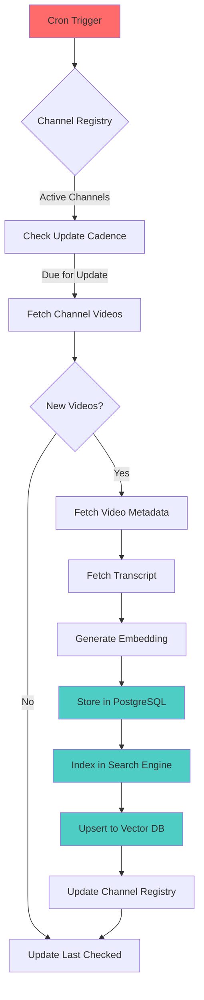
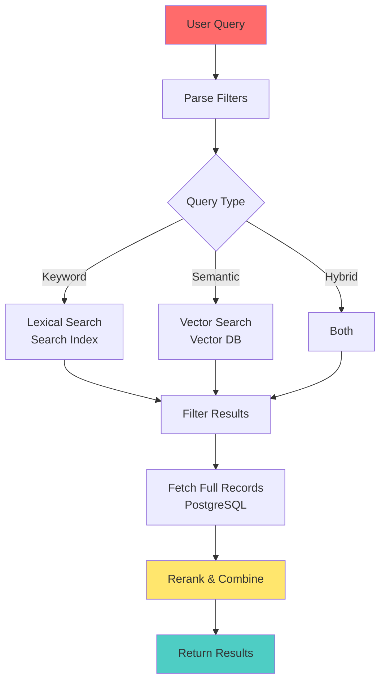
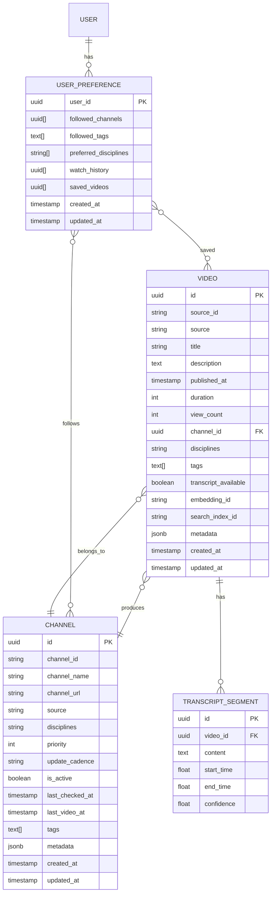

# Science Video Database - Architecture

## Overview

The Science Video Database is a curated search platform for technical science videos, supporting biology, chemistry, computer science, mathematics, and physics content. The system ingests videos from YouTube and other sources, extracts transcripts, generates embeddings, and provides hybrid search (lexical + semantic) capabilities.

## System Architecture

```
┌─────────────────────────────────────────────────────────────┐
│                        Frontend                              │
│                  Next.js 14 (App Router)                     │
│  ┌──────────┐  ┌──────────┐  ┌──────────┐  ┌──────────┐   │
│  │   Home   │  │  Search  │  │ Channel  │  │  Video   │   │
│  │   Page   │  │   Page   │  │   Hub    │  │  Detail  │   │
│  └──────────┘  └──────────┘  └──────────┘  └──────────┘   │
└─────────────────────────────────────────────────────────────┘
                            │
                            │ HTTP/API
                            │
┌─────────────────────────────────────────────────────────────┐
│                    API Layer (Edge)                          │
│  ┌──────────────┐  ┌──────────────┐  ┌──────────────┐     │
│  │ Search API   │  │ Video API    │  │ Channel API  │     │
│  │ (Hybrid)     │  │              │  │              │     │
│  └──────────────┘  └──────────────┘  └──────────────┘     │
└─────────────────────────────────────────────────────────────┘
                            │
        ┌───────────────────┼───────────────────┐
        │                   │                   │
┌───────▼────────┐  ┌───────▼────────┐  ┌───────▼────────┐
│   PostgreSQL   │  │  Vector DB     │  │  Search Index  │
│   (Supabase/   │  │  (Pinecone/    │  │  (Meilisearch/ │
│    Neon)       │  │  Weaviate/     │  │  OpenSearch)   │
│                │  │  Qdrant)       │  │                │
└────────────────┘  └────────────────┘  └────────────────┘

┌─────────────────────────────────────────────────────────────┐
│              Ingestion Worker (Serverless)                   │
│  ┌──────────────┐  ┌──────────────┐  ┌──────────────┐     │
│  │ YouTube API  │  │ Transcript   │  │  Embedding   │     │
│  │   Client     │  │  Extraction  │  │  Generation  │     │
│  └──────────────┘  └──────────────┘  └──────────────┘     │
└─────────────────────────────────────────────────────────────┘
                            │
                            │ Scheduled (Cron)
                            │
┌───────────────────────────▼──────────────────────────────────┐
│                    Channel Registry                           │
│              (Priority, Update Cadence)                       │
└──────────────────────────────────────────────────────────────┘
```

## Data Flow

### Ingestion Flow



### Search Flow



## Database Schema

### Entity Relationship Diagram



## Components

### 1. Frontend (apps/web)

**Technology**: Next.js 14 with App Router, React Server Components

**Key Pages**:
- `/` - Home page with trending content and discipline browse
- `/search` - Global search with filters
- `/discipline/[name]` - Discipline-specific hub
- `/channel/[id]` - Channel page
- `/video/[id]` - Video detail with transcript search
- `/feed` - Personalized feed (future)

**Features**:
- Server-side rendering for SEO
- Edge-friendly API routes for fast search
- Infinite scroll for results
- Transcript highlighting with jump-to-time
- Filter sidebar (discipline, channel, date, duration, tags)

### 2. Ingestion Worker (packages/ingestion)

**Technology**: Node.js/TypeScript, can run as Vercel serverless or external worker

**Responsibilities**:
- Fetch videos from YouTube Data API
- Extract transcripts via Captions API or youtube-transcript-api
- Generate embeddings (OpenAI text-embedding-3-large or local model)
- Store records in PostgreSQL
- Index in search engine (Meilisearch/OpenSearch)
- Upsert embeddings to vector DB

**Scheduling**:
- Cron jobs per discipline/channel
- Priority-based queue
- Rate limiting and quota management
- Retry logic with exponential backoff

### 3. Search Service

**Hybrid Search Approach**:
1. **Lexical Search** (Search Index):
   - Keyword matching in title, description, tags
   - Faceted filtering (discipline, channel, date range, duration)
   - Fast, exact matches

2. **Semantic Search** (Vector DB):
   - Embedding similarity search
   - Query expansion and reranking
   - Handles synonyms and conceptual matches

3. **Combination**:
   - Rerank lexical results with semantic scores
   - Weighted combination based on query type
   - Return top N results

### 4. Database (PostgreSQL)

**Schema Highlights**:
- `videos` - Canonical video records
- `transcript_segments` - Time-stamped transcript chunks
- `channels` - Channel registry with ingestion metadata
- `user_preferences` - User personalization data (future)

**Indexes**:
- `videos.published_at` (for recency sorting)
- `videos.channel_id` (for channel filtering)
- `videos.disciplines` (GIN index for array queries)
- `transcript_segments.video_id` (for transcript lookups)

### 5. Vector Database

**Purpose**: Store embeddings for semantic search

**Options**:
- **Pinecone**: Managed, easy to use, good for production
- **Weaviate**: Self-hostable, rich features
- **Qdrant**: Open-source, performant

**Structure**:
- Each video has an embedding vector (title + description + transcript)
- Metadata includes video ID, discipline, channel for filtering
- Similarity search returns top K with metadata

### 6. Search Index

**Purpose**: Fast keyword search and faceted filtering

**Options**:
- **Meilisearch**: Fast, typo-tolerant, easy setup
- **OpenSearch/Elasticsearch**: More features, higher complexity

**Fields Indexed**:
- title, description, tags (full-text search)
- discipline, channel, published_at (facets)
- duration, view_count (numeric filters)

## API Design

### Search API

```
GET /api/search?q={query}&discipline={discipline}&channel={channelId}&...

Response:
{
  "data": [
    {
      "video": { ... },
      "score": 0.95,
      "matchedSegments": [ ... ],
      "highlight": "..."
    }
  ],
  "pagination": {
    "page": 1,
    "pageSize": 20,
    "total": 1234,
    "totalPages": 62
  }
}
```

### Video API

```
GET /api/videos/{id}

Response:
{
  "data": {
    "video": { ... },
    "transcript": [ ... ],
    "related": [ ... ]
  }
}
```

## Infrastructure

### Deployment

- **Frontend**: Vercel (automatic deployments, edge network)
- **API Routes**: Vercel Serverless Functions (edge runtime where possible)
- **Ingestion**: Vercel Cron Jobs or external worker (Temporal, Airflow)
- **Database**: Supabase or Neon (managed PostgreSQL)
- **Vector DB**: Pinecone (managed) or self-hosted
- **Search Index**: Meilisearch (managed) or self-hosted

### Environment Variables

```bash
# Database
DATABASE_URL=

# YouTube API
YOUTUBE_API_KEY=

# Vector DB
VECTOR_DB_API_KEY=
VECTOR_DB_URL=

# Search Index
SEARCH_INDEX_URL=
SEARCH_INDEX_API_KEY=

# Embeddings
OPENAI_API_KEY=  # or use local model

# Auth (future)
NEXT_PUBLIC_SUPABASE_URL=
NEXT_PUBLIC_SUPABASE_ANON_KEY=
```

### Monitoring & Observability

- **Logging**: Logtail, Datadog, or Vercel Analytics
- **Error Tracking**: Sentry
- **Uptime**: Uptime monitoring for critical endpoints
- **Metrics**: YouTube API quota usage, ingestion rates, search latency

## Scalability Considerations

### Ingestion

- **Rate Limiting**: Respect YouTube API quotas (10,000 units/day default)
- **Batch Processing**: Process multiple videos in parallel
- **Incremental Updates**: Only fetch new videos since last check
- **Queue System**: Use queue for high-volume ingestion (Bull, RabbitMQ)

### Search

- **Caching**: Cache popular searches and filter combinations
- **Edge Distribution**: Use edge functions for low-latency search
- **Pagination**: Limit result sets, use cursor-based pagination

### Storage

- **Transcript Storage**: Consider object storage (S3/R2) for large transcripts
- **Thumbnail Caching**: CDN for video thumbnails
- **Database Optimization**: Partition tables by date, use read replicas

## Security

- **API Keys**: Store in environment variables, never commit
- **Rate Limiting**: Implement rate limits on public APIs
- **Input Validation**: Validate and sanitize all user inputs
- **CORS**: Configure CORS appropriately for API routes

## Development Workflow

1. **Local Development**:
   - Frontend: `npm run dev` in apps/web
   - Ingestion: `npm run ingest` in packages/ingestion
   - Use local PostgreSQL or Docker containers

2. **Testing**:
   - Unit tests for ingestion logic
   - Integration tests for API routes
   - E2E tests for critical user flows

3. **CI/CD**:
   - GitHub Actions for linting, type-checking, tests
   - Automatic deployments to Vercel on main branch
   - Preview deployments for PRs

## Future Enhancements

- **User Accounts**: Authentication, saved playlists, watch history
- **Recommendations**: ML-based personalized recommendations
- **Email Digests**: Weekly summaries of new content
- **Admin Dashboard**: Channel management, analytics, moderation
- **API Rate Limits**: Per-user rate limiting and quotas
- **Multi-language**: Support for non-English transcripts
- **Video Clips**: Extract and highlight key moments
- **Related Videos**: Graph-based related video suggestions

